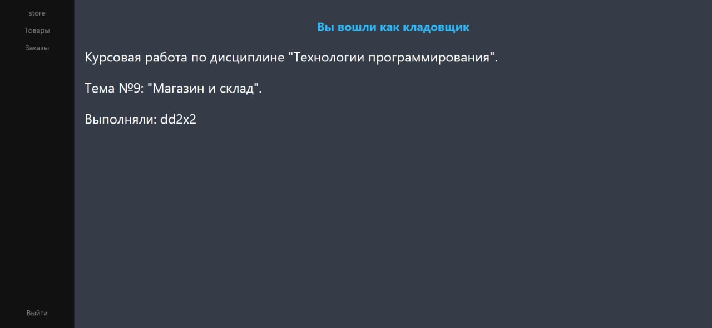

# Веб-приложение по дисциплине Технологии программирования. ТП РУТ (МИИТ)

Тема: Магазин и склад

Подразумевает наличие сущностей: администратор, продавец, кладовщик.
 
- От лица администратора осуществляется регистрация пользователей;
- От лица продавца осуществляется продажа, принятие, возврат товара;
- От лица кладовщика осуществляется отправка, принятие возвращённого товара.

Приложение написано на **Java** с использованием **Spring Framework**.
 
Для базы данных используется **MySQL**, данные сохранялись через **Spring JPA**, связь с базой данных происходила через **Hibernate**, регистрация пользователей происходила через **Spring Security**.

## Пример работы программы

